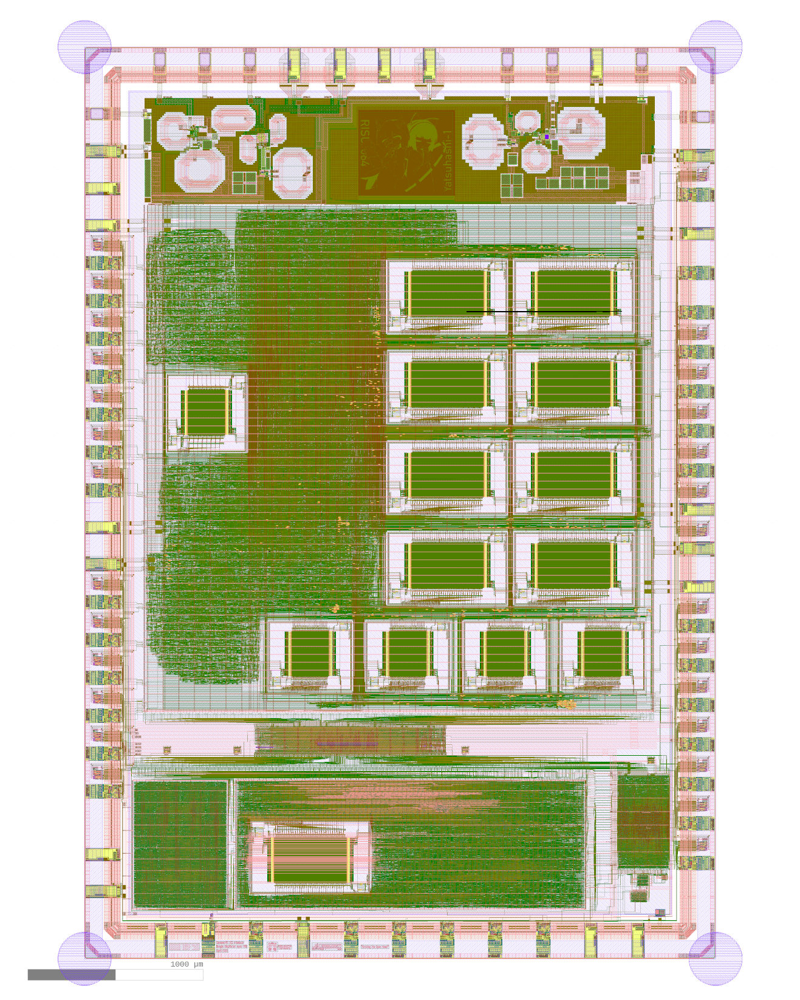

# RISu064


RISu64 (Reduced Instruction Set μProcessor 64 / Squirrel 64) is a series of my toy 64-bit RISC-V compatible processors. RISu064 (this repo) is the first in the series. Illustration by [Andy Lithia](https://github.com/andylithia).

## Features


- RV64IMZicsr_Zifencei instruction set
- 7-stage pipeline: PCGen(F1), IMem(F2), Decode(ID), Issue(IX), Execute(EX), DMem(MEM), Writeback(WB).
- In-order issue and out-of-order writeback
- Dual-issue
- BTB + Bimodal/Gselect/Gshare/Tournament + RAS branch predictors
- 2x Integer (arithmetic, barrel shifter, branch)
- 1x Load store unit (aligned access only, unaligned access generate precise exception)
- 1x Multiply/ divide unit (non-pipelined, 3/6-cycle 32/64bit multiply, 34/66-cycle 64bit divide)
- Multiply/ divide is optional
- Optional L1 instruction and data cache (2-way set associative blocking cache)
- Machine mode with exception and interrupt support
- Optional experimental hardware refilled MMU + supervisor and user mode support
- Written in portable synthesizable Verilog

## Performance

The performance varies based on configurations:

- Single-issue + 512-entry Bimodal + 32-entry BTB + TCM: 3.01 Coremark/MHz
- Single-issue + 4K-entry Tournament + 32-entry BTB + TCM: 3.06 Coremark/MHz
- Single-issue + 4K-entry Tournament + 32-entry BTB + 16KB L1$: 3.01 Coremark/MHz
- Dual-issue + 4K-entry Tournament + 32-entry BTB + TCM: 4.31 Coremark/MHz

Note:

1. Compiled with GCC 9.2.0, with the following options: ```-MD -O3 -mabi=lp64 -march=rv64im -mcmodel=medany -ffreestanding -nostdlib -fomit-frame-pointer -funroll-all-loops -finline-limit=1000 -ftree-dominator-opts -fno-if-conversion2 -fselective-scheduling -fno-code-hoisting -freorder-blocks-and-partition```
2. Single-issue is no longer supported in the latest branch, testing was carried out using commit ```efd0d3```
3. L1-cache is organized as 2-way set associative, 16KB each, with simulated unlimited L2 memory and 15-cycle latency
4. Each BPU entry is 2-bit, internally it expects 8-bit wide memory interface. 4K-entry = 1K x 8bit SRAM

## Area

The area is quite big right now (rather poor PPA).

FPGA:

Currently the multiplier is not optimized for FPGA yet. With Aritx-7 XC7A100T-3CSG324C:

- Multiplier disabled, no cache: ~120 MHz fmax, 19.6K LUT, 6.9K FF

The critical path is at write-back stage.

ASIC:

The project has been submitted to Google + efabless MPW-7 shuttle for tapeout, with a 5GHz narrow-band RF transceiver.



The total area allocated to this project is about 8.5mm^2. The core is configured to be:

- 4K depth Gshare predictor
- 8KB 2-way I-cache + 8KB 2-way D-cache
- Hardware multiplier and divider enabled
- MMU disabled, machine mode only

Total area allocated to core minus SRAM cell is about 3.4mm^2, with around 39% utilization. Assuming 85% target placement density, this translate to a 1.56mm^2 die area at SKY130 process with SKY130HD cell library.

Regarding maximum frequency, without SRAM/ cache, Fmax is around 100MHz with CLA+KSA hybrid adder, or 80MHz with inferred adder. With cache, tag comparsion logic becomes the critical path and Fmax drops to about 50MHz.

## Status

This project is mostly a proof-of-concept and is regarded as done. There might be bug fixes in the future, but don't expect major changes.

## Running Simulation

In sim folder, run make. It should build the simulator.

To run coremark, build the coremark by running ```make``` in tests/coremark, then in the sim folder do ```./simulator --ram ../tests/coremark/coremark.bin```.

Note: Verilator required for building the simulator. RV64 gcc (riscv64-unknown-elf-gcc) required for building the coremark.

## Acknowledgements

During the design of this processor, I have used the following projects as reference:

- [lowRISC's muntjac](https://github.com/lowRISC/muntjac), Apache 2.0 license
- [UltraEmbedded's biriscv](https://github.com/ultraembedded/biriscv), Apache 2.0 license

The following third-party code have been used:

- [Gary Guo's round robin arbiter](https://garyguo.net/), BSD license

## License

MIT
